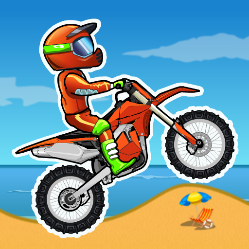

# Project Proposal: "*Elerit Escape*"
## Identifying and Defining
### Identifying a Need:
- '*Elerit Escape*' is a 2D platformer made with Unity which is great entertainment for all ages, requiring careful coordination and a fast reaction time. By making this game, I hope to not only cure the boredom of a wide group of people, but also to give them skills in problem solving, strategic planning, and concentration.
### Requirements Outline:
- Inputs: the user, using 'WASD' or arrow keys, must be able to successful control The Player.
- Processing: the game will first take the player to a splash screen, then a cutscreen, then allow them to go through various different levels. A 'shop' area in the splash screen could also be incorporated.'
- Outputs: the user will be presented with an easy and accessible GUI as well as entertaining and well-drawn graphics for the game.
- Transmission: the game only requires the connection between the game and the singular player.
- Storage: the player's high score, amount of 'coins', and the level the player is up to will be saved locally.
### Functional and Non-Functional Specifications:
- Functional:
    - User Interaction: the user will use either 'WASD' or the arrow keys to move the player through the level. They can also use the cursor to select different items from the shop, enter into the game through the splashscreen, and scroll through the 'help' option.
    - Scoring and Feedback: after each level, the user will receive a certain amount of 'coins' (which are collected throughout the level), as well as a score for the time they took to complete the level.
    - Core Gameplay or Simulation Mechanics: the most important action is the act of the user progressing (usually in a forward direction) through the level. Being able to navigate various functions is also integral, but not the main focus of the game.
    - Level Progression: when a user first enters the main game from the title screen, and completes it; they will have three options; to return to home, access the shop, or continue to the next level. In the 'home' area, the user can also select which level they wish to play (if they've unlocked it).

- Non-Functional:
    - The game should include features such as: a splash screen, a 'help' menu, a pause and mute button, a play button, a quit button, a shop for different upgrades and boosts, and multiple functioning levels.
    - Performance: the game should load in less than 3 seconds and be able to run without obvious lag, allowing for ideal user experience and a smooth gameplay.
    - Usability: the game has instructions which can be opened from the home page which will give the user a basic guide on how to operate the game. The first level will also serve as a tutorial, being slow paced with text to guide the user through.
    - Compatibility: the physics and scaling of the game must be identical across different PCs: with my 'Space to Sea' game, this was an issue. The game will not be compatible with mobile, as it needs a keyboard to function.
    - Scalability: the main thing which could be expanded upon is the amount of levels; although it could function like games such as 'Moto X3M' with a certain amount of levels to complete, I believe it could also work as an expanding amount. Many of my favourite games add new levels every few months, which is a good expansion method.
    - Reliability and Availability: the game should be functioning and available a vast majority of the time, and if there is a disruption, it should be quickly rectified.
### Social and Ethical Issues:
> Equity: the quality of being fair and just, especially in a way that takes account of and seeks to address existing inequalities.

> Accesibility: the quality of being able to be reached or entered.
- Accessiblity: the most important consideration to take in when designing 'Elerit Escape' is whether it is accessible for a wide range of age groups. This can be ensured through an in-depth instruction manual and tutorial, as well as levels which can be enjoyed regardless of skill level (which is often impacted by factors such as age). The time-scoring system allows for individuals to have different goals when completing the game, making it more accessible overall. The simplicity and easiness of the game makes it accessible for people with disabilities as well; the tutorial is based on text on the screen, and there will be no heavy flashing to ensure those who are epilectic won't be negatively affected. 
- Privacy and Data Collection: the game stores data locally, meaning that there isn't a threat of data being used unsafely or leaked online; I'll also ensure that there are no spaces where the user is expected to enter personal information, in case of any kind of data breach. The storage of data will be conveyed to the user clearly and accurately.
- Fairness and Representation: one important tool for representation is the different 'skins' which the player is able to select at the beginning of the game, which include a variety of races, genders, etc. The game won't include stereotypes or biases as the only personified elements are the user (with an appearance of their choice) and the zombies, which don't correlate to any specific group.
- Mental and Emotional Wellbeing: a mental or emotional issue could be the question of whether or not the game is too violent to be suitable for all ages; as it includes zombies. This can easily be solved by ensuring graphics are designed to be safe for children and don't include anything which actually fully fits the somewhat horror-adjacent aspects of the game. The pixelated and playful style will also support this.
- Cultural Sensitivities: the design of the user's skin could be considered offensive if it is designed badly or according to stereotypes. This can be solved by ensuring that stereotypes and possible offensive factors are understood and avoided through understanding.
## Researching and Planning
### Evaluation of Existing Ideas:
Existing Idea | Plus | Minus | Implication |
|---| -----|-------|-------------|
|Moto X3M | This game is super influencial when it comes to the designing of 'Elerit Escape'; the accessibility, timed high score, completibility of the game, and ability to unlock different skins allow for an enjoyable, accessible, and engaging experience. |One factor which 'Moto X3M' lacks in is the artistic elements; the graphics are repetitive and underwhelming. | Both of these can be applied to my game; by including fun, simple, and doable elements users are able to enjoy playing the game both for leisure and as a way to beat their own records in it. I will also avoid having boring and overly simple graphics by spending a great deal of time creating the artwork for the game.
|Subway Surfers  | Subway Surfers is a great and popular game for reasons such as its variety of skill levels which it can be played with (as the game gradually gets harder, allowing for users with any level of experience to enjoy it). It is fast-paced, and a great take on a running style of platformer. | Issues with Subway Surfers, according to many players who reviewed it, include the constant stream of ads (including unsafe ones). This also causes performance to decrease. | Subway Surfers is also one which inspires 'Elerit Escape'; I intend to include many of the faster-paced aspects, as the purpose is to escape from the enemies which are chasing you (somewhat similar to Subway Surfers). My game won't include ads, which ensures user enjoyment and game performance.
|Stickman Hook | Stickman Hook is an addicting and very enjoyable small game; its simple, repetitive features and satisfying gameplay allow for an opportunity for users to relax and play something relatively mind-numbing but nonetheless fun. The users are also able to unlock different skins as they move through the game, giving an incentive to keep going. | The simplicity mentioned in the 'plus' section could also be perceived as a negative aspect of Stickman Hook; some people may become bored of it easily as each level has an identical theme and has very similar gameplay. | The satisfying gameplay is something I intend to incorporate in 'Elerit Escape' as it's the main thing that keeps users so hooked on 'Stickman Hook'; I can do this through smooth physics, entertaining animations, and sound effects. By avoiding full simplicity and, as I previously mentioned, focusing on art, I'll ensure users don't get bored whilst playing.
### Pseudocode and Flowcharts:
